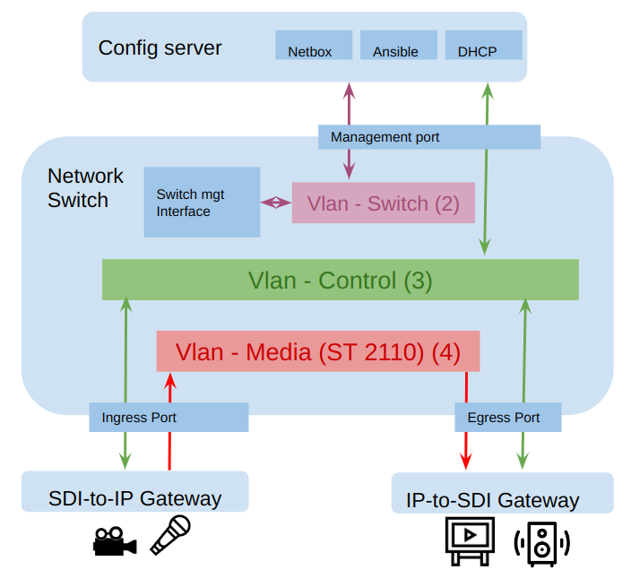

# README #

## What is this repository for?


* [Demo @ SMPTE Bootcamp in MTL 2023](https://www.smpte.org/sections/montrealquebec-bootcamp-2020)
* Config + scripts to deploy a simple ST2110 setup
* Sponsored by:


## Infra Network (static)

* Switch: 192.168.0.0/24
* Endpoints/devices/gateways: 192.168.1.0/24



## Services

|*Service*|*HTTP port*|
|---------|-----------|
| Netbox  |      2000 |
| DHCP    |      3000 |
| Riedel MNSet | 4000 |
| NMOS registry| 8000 |

[Installation guide](./server/INSTALL.md).

Test services:

```
IP=192.168..X.X # server IP for user access
firefox http://$IP:2000  http://$IP:3000/admin/#/ http://$IP:4000/ http:$IP:8000
```

## Ansible

[User guide](./ansible/README.md).

If you want to experiment with `pynetbox` without `ansible`, take a look
at the [helper scripts](./scripts/INSTALL.md).
